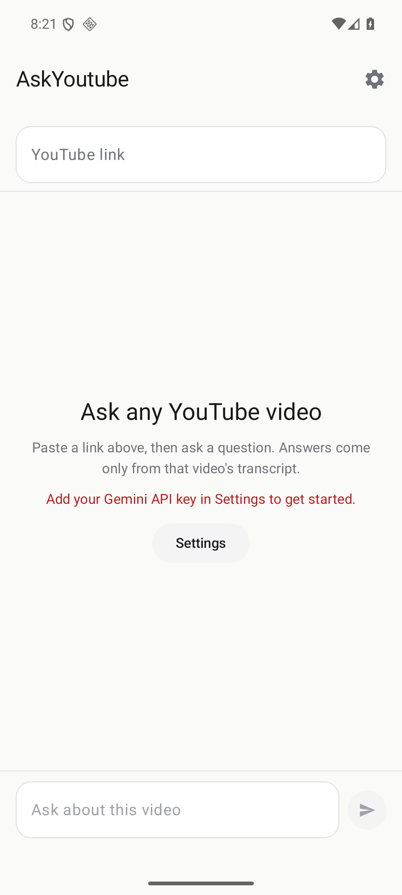
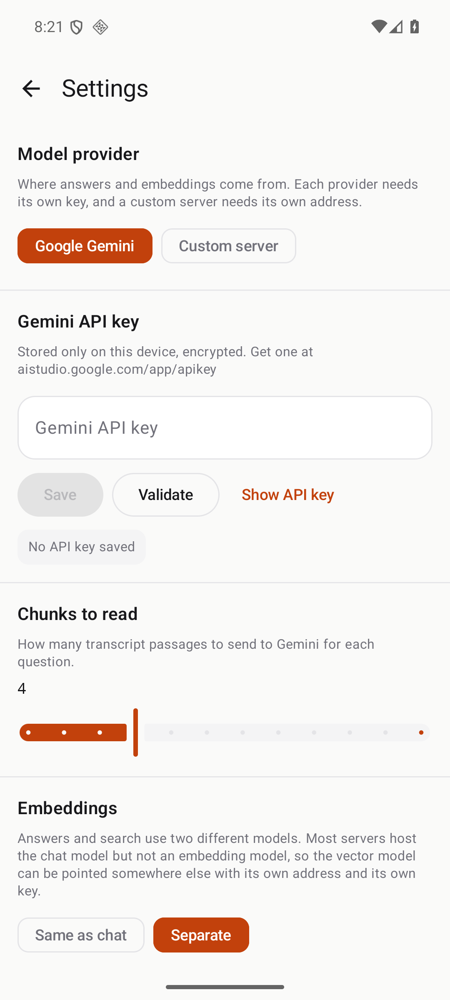
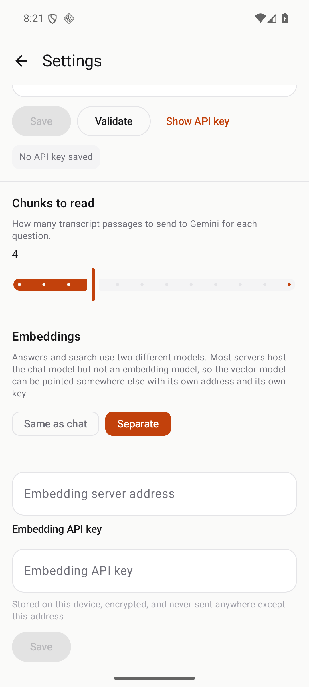
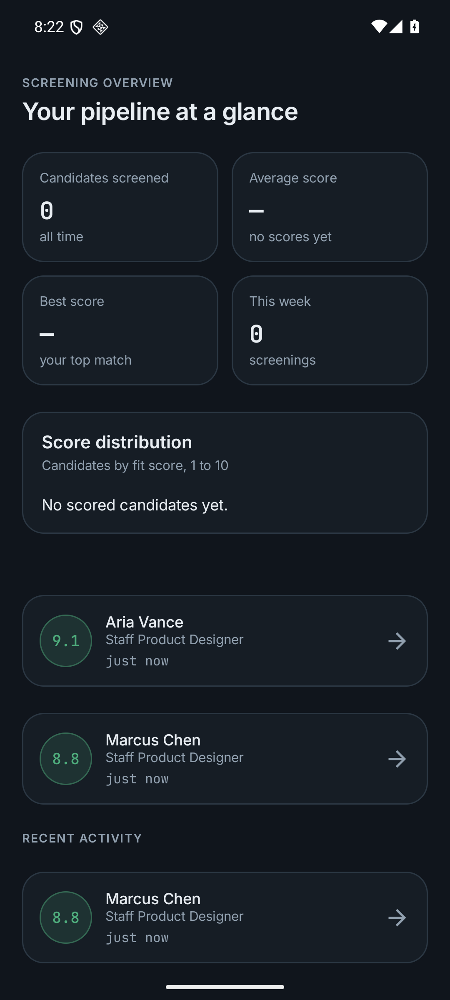

# AskYoutube

An Android app that answers questions about a YouTube video using its transcript.

Paste a link, ask a question, and get an answer grounded in that video's captions
— with the transcript passages it used shown alongside, timestamped.

There is no account, no server, and no developer API key. Everything runs on the
phone, and your API key never leaves the device.

---

## Screenshots

| Home | Settings |
|---|---|
|  |  |

| Provider and embedding configuration | Dark mode |
|---|---|
|  |  |

> There is deliberately no screenshot of a completed answer here. Captions come
> from an undocumented YouTube endpoint that returns an empty response to
> requests from datacenter IP addresses, so an answer could not be produced on the
> build machine. The mockup in `.stitch/designs/01-home-answered.png` shows the
> intended layout, but that is a design, not a capture.

---

## What it does

1. Fetches the video's transcript from YouTube's caption endpoint.
2. Splits it into overlapping passages, each keeping its video timestamp.
3. Embeds the passages with Gemini and embeds your question.
4. Retrieves the most similar passages and asks Gemini to answer using only them.
5. Shows the answer, plus the passages it drew on and when they occur.

Ask as many follow-up questions as you like. The transcript is indexed once and
reused, so only the first question pays the full embedding cost.

---

## Requirements

- Android 8.0 (API 26) or newer
- A Gemini API key — get one at [aistudio.google.com/app/apikey](https://aistudio.google.com/app/apikey)

---

## Build

Requires a JDK 17 and the Android SDK (platform 35).

```bash
export JAVA_HOME=/path/to/jdk-17
export ANDROID_HOME=/path/to/Android/Sdk

./gradlew assembleDebug          # build the APK
./gradlew testDebugUnitTest      # run the unit tests
./gradlew installDebug           # install on a connected device
```

The debug APK lands in `app/build/outputs/apk/debug/app-debug.apk`.

---

## Setup

Open the app, go to **Settings**, paste your Gemini API key, and tap **Validate**.
A green tick means Google accepted it and the key is saved. **Show** reveals what
you typed; **Clear** deletes the stored key.

Settings also holds:

- **Model provider** — *Google Gemini* (fixed host, uses your Gemini key) or
  *Custom server* for anything that speaks the OpenAI wire format, such as a
  self-hosted or third-hosted `gemma-*` model. A custom server asks for its base
  URL, its own key, and its own chat model id.
- **Embeddings** — *Same as chat* or *Separate*. This is deliberately its own
  setting because a server that hosts a chat model usually has **no embedding
  endpoint** for it. Choosing *Separate* reveals fields for a different address,
  a different key, and a different embedding model, so retrieval can run on
  Gemini while answers run on a hosted Gemma, or the reverse.
- **Chunks to read** — how many transcript passages to send for each question.
  Higher is more thorough and costs more quota; 4 is a sensible default.
- **Model ids** — editable, because providers retire models and you may need to
  move off one without waiting for a new release.
- **Appearance** — System, Light, or Dark. It follows your device setting by
  default, and the choice is remembered.

Switching provider swaps the model ids to that provider's defaults and clears the
saved key, because a key and a model id both belong to one backend.

---

## Notes on how it works

**Your key is yours.** It is stored in `EncryptedSharedPreferences`, sent only in
the `x-goog-api-key` header to `generativelanguage.googleapis.com`, never logged,
and never included in an error message. It is not in the source, the resources, or
the APK, and backups are disabled so it is not exported. On a rooted device a
stored key can still be extracted — that is the normal trade-off for
bring-your-own-key apps, and it is strictly better than shipping a developer's
key to every user.

**Transcript fetching is the fragile part.** YouTube has no official captions
API, so the app reads the player response embedded in the watch page. That is an
undocumented surface and it can break, or return an empty response on some
networks — including from datacenter IP addresses, where YouTube serves captions
as a zero-length body. When that happens the app says so plainly instead of
pretending the video had no content. Auto-generated captions are used when no
human caption track exists.

**Models.** Gemini defaults are `gemini-embedding-2` (768 dimensions) and
`gemini-3.5-flash`, both verified working against the live API on 2026-09-30. A
custom server defaults to `text-embedding-3-small` and `gemma-4-31B-it`, which
you should change to whatever your host actually serves.

**Keys and where they go.** Each key is stored encrypted on the device and sent
only to its own configured address, in its own auth header. The Gemini key only
ever goes to `generativelanguage.googleapis.com`; a custom server's key only ever
goes to the address you typed. If you set a separate embedding key, that one is
stored the same way and goes only to the embedding address. If you point a
provider at a third-party host, you are trusting that host with the key you give
it — use a key scoped to that service.

**Design.** The UI was designed in Google Stitch from `.stitch/DESIGN.md` and
ported to Compose by hand. The exported HTML and PNGs are kept in
`.stitch/designs/`. Stitch's own code export is HTML, not Kotlin.

## Follow-up questions

After an answer, the app offers up to four tappable follow-up questions. They are
picked on the device from the transcript passages the answer just used, so they
stay grounded in that video, and they skip anything already asked.

They cost nothing: no second model call, no extra quota, no added latency. An
earlier version asked the model to suggest them, which spent a request on a
mechanical task and could fail after the answer had already arrived. Tapping a
suggestion fills the composer rather than sending, so you can edit it first.

## What is verified, and what is not

Verified here: the app compiles, 55 unit tests pass, and it installs and renders
on an Android 16 emulator in both light and dark themes, with the error path
exercised.

Not verified: the full end-to-end answer. It needs a live Gemini API key, and a
live transcript fetch needs a residential network, because YouTube serves empty
captions to datacenter IPs. See `.migration/validation.yaml` for the per-feature
matrix.

---

## Project layout

```
app/src/main/java/com/askyoutube/app/
  domain/      VideoId, Chunker, VectorIndex, RagEngine, AppError
  data/
    gemini/    GeminiClient        REST calls to Gemini
    transcript/ fetcher and parser for YouTube captions
    settings/  SettingsStore       encrypted key and preferences
  ui/
    home/      HomeScreen, HomeViewModel
    settings/  SettingsScreen, SettingsViewModel
  network/     shared OkHttp client
```

`domain/` holds the logic worth testing and is deliberately free of Android
dependencies, so it runs in plain JVM unit tests.

---

## License

GPL-3.0, matching the original Streamlit project this was ported from.
